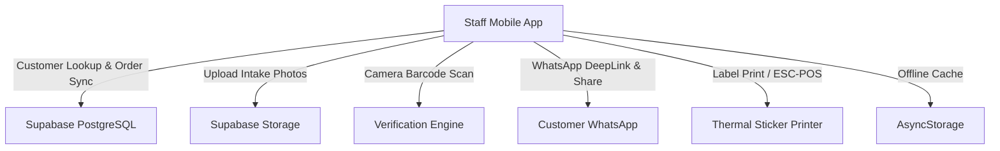

# Laundry Order Tracking & Verification System (MVP) — Design Document

## 1. Executive Summary
The Laundry Order Tracking & Verification System is a mobile application built for laundry business staff to eliminate lost and mixed-up garments during washing, sorting, and packaging. The app accelerates counter intake with rapid tap-tap item counters, records 2 wide-angle intake photos as proof, auto-populates customer data by phone number, generates scannable barcode tags for baskets, sends instant WhatsApp receipts, and enables rapid photo-assisted sorting and verification.

---

## 2. Technology Stack & Dependencies
- **Client Framework:** React Native with Expo (SDK 52+, Expo Router, TypeScript)
- **Styling & UI:** React Native StyleSheet / Modern Design System with haptic feedback (`expo-haptics`)
- **Backend & Database:** Supabase (PostgreSQL, Supabase Storage for wide-angle photos, Realtime database)
- **Local Persistence & Cache:** AsyncStorage (offline caching of customers, active intake drafts, and offline orders queue)
- **Camera & Scanner:** `expo-camera` (for taking dual wide-angle photos and instant barcode/QR scanning)
- **Barcode & Printing:** `react-native-svg` + `jsbarcode` / `qrcode`, `expo-print` (AirPrint & PDF labels), ESC/POS Bluetooth thermal printing support
- **Receipt & Sharing:** `Linking` (`whatsapp://send` / `https://wa.me`) + `expo-sharing` (native multi-file share sheet)

---

## 3. System Architecture & Core Modules



### Module 1: Customer Auto-Fill & Directory
- Real-time customer search on phone number input.
- Automatically saves new customer names, addresses, and special preferences to Supabase on order creation.
- Local AsyncStorage cache allows instant auto-complete even under weak cellular connectivity.

### Module 2: High-Speed "Tap-Tap" Intake Counter
- Grid of preset garment categories with large `+` and `-` touch targets:
  - Shirts / Tops
  - Pants / Trousers / Jeans
  - Dresses / Traditional Wear
  - Bedding / Blankets / Curtains
  - Delicate / Dry Clean / Suits
  - Custom Item & Special Instructions
- Live piece counter and live bill total calculator with custom price configurations.

### Module 3: Dual Wide-Angle Photo Proof
- Fast 2-step camera shutter:
  - **Photo 1:** Wide-angle overview of all laid-out garments.
  - **Photo 2:** Detailed layout / care labels / special stains.
- Automatic image compression before upload to Supabase Storage.
- Local thumbnail generation for instant UI responsiveness.

### Module 4: Dynamic Barcode Generation & Basket Tagging
- Unique order codes generated per intake (e.g. `LND-8492` or timestamp-hash).
- Renders scannable Code128 and QR code formats.
- Supports instant printable sticker labels (2" / 3" thermal format) or full-screen digital basket display.

### Module 5: WhatsApp Instant Receipt Engine
- Instant WhatsApp deep-link generation with formatted Markdown receipt:
  - Order Code & Customer Name
  - Detailed Garment Count Breakdown & Total Items
  - Total Bill Amount & Payment Status
  - Public URLs for the 2 intake proof photos
- One-tap native share sheet to directly send photo files and PDF invoices.

### Module 6: Sorting & Image-Verified Packing Station
- Continuous camera scanner mode: point camera at basket barcode.
- Instant modal/card popup showing:
  - Total expected piece count.
  - Full breakdown of garments.
  - High-res side-by-side view of both intake photos (with pinch-to-zoom).
  - Interactive packing checklist.
- One-tap status update to `"Ready for Delivery"` with audit timestamp.

---

## 4. Database Schema (Supabase)

```sql
-- Customers Table
CREATE TABLE customers (
  id UUID PRIMARY KEY DEFAULT gen_random_uuid(),
  phone VARCHAR(20) UNIQUE NOT NULL,
  name VARCHAR(100) NOT NULL,
  address TEXT,
  notes TEXT,
  created_at TIMESTAMP WITH TIME ZONE DEFAULT NOW()
);

-- Orders Table
CREATE TABLE orders (
  id UUID PRIMARY KEY DEFAULT gen_random_uuid(),
  order_code VARCHAR(20) UNIQUE NOT NULL,
  customer_id UUID REFERENCES customers(id) ON DELETE SET NULL,
  customer_phone VARCHAR(20) NOT NULL,
  customer_name VARCHAR(100) NOT NULL,
  total_pieces INT NOT NULL DEFAULT 0,
  total_amount NUMERIC(10, 2) NOT NULL DEFAULT 0.00,
  status VARCHAR(30) DEFAULT 'intake', -- 'intake', 'washing', 'sorting', 'ready_for_delivery', 'delivered'
  photo_urls TEXT[] NOT NULL DEFAULT '{}',
  notes TEXT,
  created_at TIMESTAMP WITH TIME ZONE DEFAULT NOW(),
  verified_at TIMESTAMP WITH TIME ZONE,
  verified_by VARCHAR(50)
);

-- Order Items Table
CREATE TABLE order_items (
  id UUID PRIMARY KEY DEFAULT gen_random_uuid(),
  order_id UUID REFERENCES orders(id) ON DELETE CASCADE,
  item_type VARCHAR(50) NOT NULL,
  quantity INT NOT NULL DEFAULT 1,
  unit_price NUMERIC(10, 2) DEFAULT 0.00
);

-- Supabase Storage Bucket
-- Bucket Name: "order-photos" (Public access enabled for WhatsApp photo links)
```

---

## 5. User Interface & Screen Architecture
1. **Intake / New Order Screen:**
   - Phone lookup input with auto-suggestions.
   - Tap-tap garment counter matrix.
   - Dual photo capture preview.
   - Summary bar with "Create Order & Tag" CTA.
2. **Order Success & Share Modal:**
   - Generated Barcode display.
   - "Share WhatsApp Receipt" button.
   - "Print Basket Tag" button.
   - "Start Next Order" button.
3. **Verification / Sorting Scanner Screen:**
   - Fullscreen camera viewfinder for barcode scanning.
   - Verification sheet showing intake photos, expected vs packed count, and "Mark Ready" button.
4. **Order History & Active Pipeline Screen:**
   - Tabbed view: `All`, `In Washing`, `In Sorting`, `Ready for Delivery`.
   - Filter by phone number, customer name, or order code.
5. **Settings & Pricing Config Screen:**
   - Supabase connection settings (URL + Anon Key).
   - Default prices per garment type.
   - Business branding name and WhatsApp message template editor.

---

## 6. Error Handling & Edge Cases
- **No Internet Connectivity:** App caches customer profiles and queues new orders in AsyncStorage; syncs with Supabase once network reconnects.
- **Missing Photo Upload:** Local image URI retained on device so receipt can still be generated and uploaded when online.
- **Unrecognized Barcode:** Scanner gives immediate audio-haptic feedback with manual Order ID search fallback.
