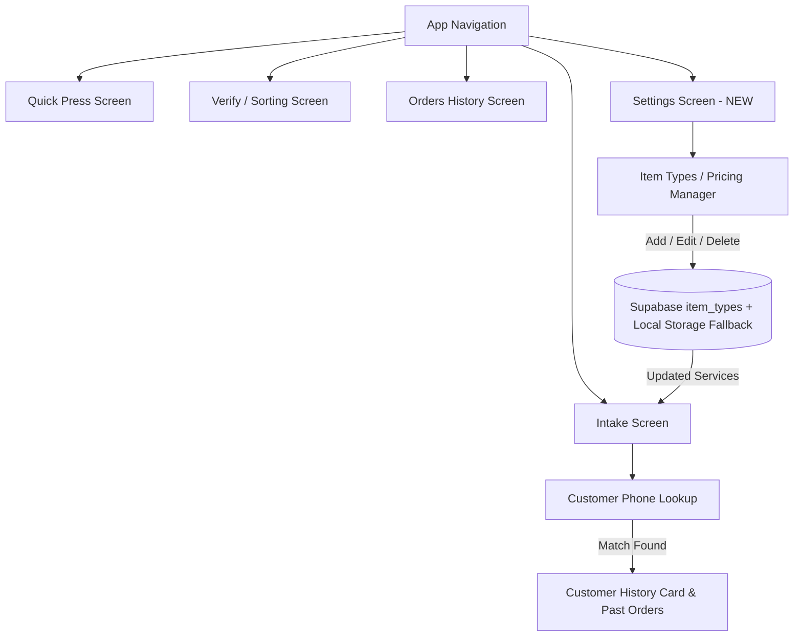

# Design Specification: Premium UI, Customer History & Service Settings

## 1. Executive Summary
This design doc outlines the architectural and UI upgrades for the Laundry Management app:
1. **Modern Premium UI Overhaul**: Vibrant theme, crisp cards, status badges, modern bottom tab bar.
2. **Customer History Auto-Lookup**: Seamless order history panel in `IntakeScreen` when a customer's phone number is entered/selected.
3. **Services & Pricing Settings Tab**: Full management UI to add new services/garments and edit prices dynamically on the fly.

---

## 2. Architecture & Data Flow

### Data Layer (`ordersApi.js` & Local Cache)
- **`fetchCustomerOrders(phoneNumber)`**: Retrieves past orders for a specific phone number from Supabase `orders` joining `order_items` & `customers`, with fallback to local store `LOCAL_ORDERS_STORE`.
- **`fetchItemTypes()`**: Retrieves item types/services sorted by `sort_order`.
- **`addItemType(serviceObj)`**: Adds a new service to `item_types` table or local memory.
- **`updateItemType(id, updates)`**: Modifies service name, unit type, or default price.
- **`deleteItemType(id)`**: Deletes/Deactivates a service.

---

## 3. UI Component Details

### A. Theme & Styling Upgrade (`src/theme.js`)
- Primary Color: `#2563EB` (Vibrant Blue) & `#3B82F6` (Electric Blue)
- Surface / Cards: Crisp light cards with subtle borders (`#E2E8F0`), smooth radius (`14px` & `20px`), subtle elevation shadows.
- Status Badges:
  - `intake`: Amber badge (`#F59E0B`)
  - `washing`: Blue badge (`#3B82F6`)
  - `ready_for_delivery`: Emerald green (`#10B981`)
  - `delivered`: Slate (`#64748B`)

### B. Intake Screen & Customer History Panel (`src/screens/IntakeScreen.js`)
- **Live Search**: When user types phone number or selects suggested customer:
  - Triggers `fetchCustomerOrders(phone)`.
  - If existing orders > 0, displays **Customer History Header**:
    - "⭐ Returning Customer — 5 Previous Orders ($340 total)"
    - Accordion to toggle viewing past order list (Order Code, Date, Item list breakdown, Status).
    - Quick "Re-order Previous Items" button to pre-fill garment counters!

### C. Settings Screen (`src/screens/SettingsScreen.js`)
- Tab icon: `⚙️ Settings`.
- **Section 1: Manage Services & Pricing**:
  - List of services with icon, name, unit type (`piece`, `kg`, `pair`, `bundle`), price input, and edit/delete actions.
  - "➕ Add New Service" modal/button with inputs: Service Name, Unit Type selector, Price ($).
- **Section 2: Quick Preferences / App Version Info**.

---

## 4. Verification & Testing Plan
1. **Settings Tab**: Add a new service (e.g. "Curtains", unit: `piece`, price: 250), navigate to Intake, verify it appears in the list with the correct price.
2. **Price Modification**: Change price of "Shirt" from 40 to 45 in Settings, create an order in Intake, verify total bill uses 45 per shirt.
3. **Customer History**: Create order for customer "03001234567". Start new intake for "03001234567", verify customer history panel shows previous order code, date, and items.
